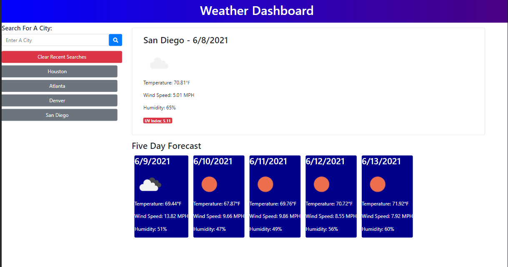

# Weather Dashboard
## Homework Week 6

===

## Description
This project consists of a Weather Dashboard that dynamically updates HTML and CSS elements using JavaScript as well as API calls to the OpenWeather API.  The page utilizes OpenWeather API to allow the user to input a city which will return current information for the weather.  The API call then uses the city latitute and longitude returned in the first call to do another API call which returns UV-Index data and future forecast data.  When the page is loaded, recent search history is loaded from the local storage and displayed on the left side, that can also be used for faster input.  

## Screenshot
Here you can find a mockup screenshot of the webpage, displaying the Weather Dashboard in action:

---

## URL
Web page can be located at [Gitpages](https://mrg105.github.io/Weather-Dashboard/ "Weather Dashboard")

## Repo
Repository can be located at [Github](https://github.com/MrG105/Weather-Dashboard "Github")

## Contact
Javascript code and Repo updated by Gabriel Gutierrez.  [email](poo328@my.utsa.edu "email")